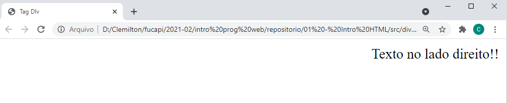
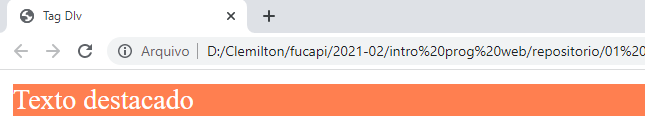
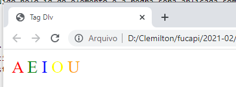

# O que é CSS?
- CSS é chamado de linguagem Cascading Style Sheet e é usado para estilizar elementos escritos em uma linguagem de marcação como HTML. O CSS separa o conteúdo da representação visual do site. Pense  na decoração da sua página. Utilizando o CSS é possível alterar a cor do texto e do fundo, fonte e espaçamento entre parágrafos. Também pode criar tabelas, usar variações de layouts, ajustar imagens para suas respectivas telas e assim por diante
- CSS foi desenvolvido pelo W3C (World Wide Web Consortium) em 1996, por uma razão bem simples. O HTML não foi projetado para ter tags que ajudariam a formatar a página. Você deveria apenas escrever a marcação para o site.
- A relação entre HTML e CSS é bem forte. Como o HTML é uma linguagem de marcação (o alicerce de um site) e o CSS é focado no estilo (toda a estética de um site), eles andam juntos.
- Não devemos entender CSS como uma linguagem de programação. Trata-se de uma linguagem descritiva composta por regras que indicam como apresentar um documento html.

# 

## Vantagens do CSS
- Você já deve ter visto um site que não carrega completamente ou tem um plano de fundo branco com texto azul e preto. Isso significa que a parte CSS do site não foi carregada corretamente ou não existe. 
- Antes de usar CSS, toda a estilização tinha que ser incluída na marcação HTML. Isso significa que você deveria descrever separadamente todo o plano de fundo, as cores das fontes, os alinhamentos, etc.
- Mas o CSS permite que você estilize tudo em um arquivo diferente, criando assim o estilo separadamente.
- Resumindo, com o CSS você não precisa mais escrever repetidamente como os elementos individuais se parecem. Isso economiza tempo, encurta o código e diminui a chance de erros.


# Sintaxe 
- O CSS permite aplicar estilos seletivamente a elementos em documentos HTML. Por exemplo, para selecionar todos os elementos parágrafo ``<p>`` de uma página HTML e tornar o texto dentro deles vermelho, você escreveria este CSS:
    - 
- Toda essa estrutura é chamada de conjunto de regras (mas geralmente usamos o termo "regra", por ser mais curto). Note os nomes das partes individuais:
    - **Seletor (Selector)**: O nome do elemento HTML no começo do conjunto de regras. Ele seleciona o(s) elemento(s) a serem estilizados (nesse caso, elementos ``<p>``). Para dar estilo a um outro elemento, é só mudar o seletor.
    - **Declaração (Declaration)**: Uma regra simples como ``color: red;`` especificando quais das propriedades do elemento você quer estilizar.
    - **Propriedades (Property)** : Forma pela qual você estiliza um elemento HTML. (Nesse caso, ``color`` é uma propriedade dos elementos ``<p>``.) Em CSS, você escolhe quais propriedades você deseja afetar com sua regra.
    - **Valor da propriedade (Property value )**: À direita da propriedade, depois dos dois pontos, nós temos **o valor de propriedade**, que escolhe uma dentre muitas aparências possíveis para uma determinada propriedade (há muitos valores color(cor) além do red(vermelho)).
- Note outras partes importante da sintaxe:
    - Cada linha de comando deve ser envolvida em chaves (``{}``).
    - Dentro de cada declaração, você deve usar dois pontos (``:``) para separar a propriedade de seus valores.
    - Dentro de cada conjunto de regras, você deve usar um ponto e vírgula (``;``) para separar cada declaração da próxima.
- Então para modificar múltiplos valores de propriedades de uma vez, você deve escrevê-los separados por ponto e vírgula, desse modo:
```css
p {
  color: red;
  width: 500px;
  border: 1px solid black;
}
```
# CSS  interno - ``<style/>``
- Existem 3 formas de utilizar: Interno, externo e inline. Vamos inicialmente utilizar o formato interno
- O CSS interno ou incorporado requer que você adicione a tags **``<style>``** na seção **``<head>``** do seu documento HTML.
- Este estilo de CSS é um método efetivo de estilizar uma única página. Contudo, usar esse estilo em múltiplas páginas pode consumir muito tempo, já que você precisa definir as regras CSS para cada página do seu site.
Confira abaixo como você pode usar o CSS interno:
    1. Abra a sua página HTML e localize a tag de abertura **``<head>``**.
    2. Coloque o seguinte código logo depois da tag **``<head>``**.
        ```html
        <style type="text/css">
        /* codigo css dentro de style */
        </style>
        ```
    3. Adicione as regras CSS numa nova linha. Aqui está um exemplo:
        ```html
        <style type="text/css">
        /* codigo css dentro de style */
        body {
            background-color: blue;
        }
        h1 {
            color: red;
            padding: 60px;
        }
        </style>
        ```
    4. Adicione elementos as tags ``h1`` e ``body`` no html:
        ```html
            <html>
            <head>
                <style>
                    body {
                        background-color: blue;
                    }
                    h1 {
                        color: red;
                        padding: 60px;
                    } 
                </style>
            </head>
            <body>

            <h1>Hostinger Tutoriais</h1>
            <p>Este é o nosso parágrafo.</p>

            </body>
            </html>
        ```

## Desvantagem css interno
- Adicionar o código para o documento HTML pode aumentar o tamanho da página e o tempo de carregamento.

# Tipos de seletores:
## Seletor por tag:
- Este seletor corresponde aos nomes das tags dos elementos html, por exemplo **p**, **a**, **h1** ou **div**. Isso significa que a regra será aplicada a todos os elementos desse tipo que aparecem no documento. Por exemplo, se queremos que todos os parágrafos tenham um determinado alinhamento ou que todos os links tenham uma certa cor.
- Exemplo:
    ```html
    <html>
        <head>
            <title>Tag DIv</title>
            <style>
                p{ text-align: right;}
            </style>
        </head>
        <body>
            <p>Texto no lado direito!!</p>
        </body>
    </html>
    ```
    - Saída: 

## Seletor por id
- Os elementos html podem ter um atributo chamado id que deve ser único e serve para identificá-lo dentro do documento. O seletor deve começar com o símbolo # seguido pelo id do elemento e a regra será aplicada somente a esse elemento. É útil para aplicar estilo a elementos que desejamos realçar.
- Exemplo: 
    ```html
    <html>
        <head>
            <title>Tag DIv</title>
            <style>
                #importante {background-color: coral; color: white;}
            </style>
        </head>
        <body>
            <p id="importante">Texto destacado</p>
        </body>
    </html>
    ```
    - Saída: 
## Seletor por classe: 
- Os elementos html podem ter um atributo chamado **class** que serve para agrupar diferentes elementos de um mesmo identificador. O seletor deve começar com o símbolo ( . ) seguido pelo nome da classe e a regra será aplicada a todos os elementos que a possuem. No exemplo abaixo, temos cinco classes e cada uma aplica-se a cada vogal no texto.
    - Exemplo:
    ```html
    <html>
        <head>
            <title>Tag DIv</title>
            <style>
                .letra_a { color: red;}
                .letra_e { color: green;}
                .letra_i { color: blue;}
                .letra_o { color: yellow;}
                .letra_u { color: orange;}
            </style>
        </head>
        <body>
            <span class="letra_a">A</span>
            <span class="letra_e">E</span>
            <span class="letra_i">I</span>
            <span class="letra_o">O</span>
            <span class="letra_u">U</span>
        </body>
    </html>
    ```
    - Saída: 
## Seletor por relação:
- Em um documento html encontramos muitos elementos, alguns estão dentro de outros, como no caso da tag div que vimos anteriormente. Outros aparecem primeiro ou depois em relação aos outros. Os seletores por relação são usados para selecionar elementos de acordo com sua relação com outros. Observe os comentários no exemplo abaixo. Observe os comentário abaixo:
```css
/* a regra seuginte se aplica aos elementos parágrafos que
estejam dentro de um elemento com classe texto_grande */
.texto_grande p {}

/* a regra seguinte se aplica aos elementos que tenham a classe
cursiva e que estem dentro de um elemento com classe texto */
.texto .cursiva{}

/* a regra seguinte se aplica ao elemento com id título que esteja
dentro do elemento com id artigo: */
#artigo #titulo {}
```

# Propriedades mais comuns
- A quantidade de propriedades dos elementos html é bastante ampla. É possível consultar a referência completa em sites especializados. Abaixo mencionamos apenas algumas para que você possa ter uma idéia geral.
## Propriedades de formatação de texto
- **text-align**: permite alinhar textos à esquerda, à direita, centralizados ou justificados.
- **font-weight**: permite ajustar a importância (espessura) da fonte.
- **font-size**: permite ajustar o tamanho da fonte.
- **font-family**: permite escolher a tipografia de um texto.
## Propriedades de espaçamento:
- **padding**: indica o espaço livre entre um elemento e seus elementos internos.
- **margin**: indica o espaço livre entre um elemento e os elementos externos.
## Propriedades de cor:
- **color**: indica a cor do elemento
- **background-color**: indica a cor de fundo do elemento

# Tarefas comuns em CSS
## Centralizar elemento
- Existem algumas maneiras diferentes de centralizar elementos. Uma das mais recorrentes é envolver o que queremos centralizar em uma div: 
```html
<html>
    <head>
        <title>Tag DIv</title>
        <style>
            .centralizar{
                /* margem vertical | margem horizontal*/
                margin: 0 auto;
                /* largura da div */
                width: 300px;
                /* centralizando texto da div */
                text-align: center;
            }
        </style>
    </head>
    <body>
        <div class="centralizar">
            <p>Este texto será centralizado, junto com a div</p>
        </div>
    </body>
</html>
```
- Desejamos centralizar um parágrafo. Para isso definimos uma div com classe ``centralizar`` e definimos as seguintes propriedades:
    - ``margin``: Precisamo definir as margens na horizontal como ``auto``,  para centralizar o elemento horizontalmente aonde está contido
    - ```width``: Definir uma largura fixa para div. Por padrão a ``div`` preenche todo espaço na direita e esquerda.
    - ``text-aling``: Definimos esta propriedade como ``center`` pois a tag de dentro é um parágrafo ``<p>``.
# Referências:
- https://www.hostinger.com.br/tutoriais/o-que-e-css-guia-basico-de-css
- https://www.hostinger.com.br/tutoriais/diferenca-entre-estilos-css
- https://edu.gcfglobal.org/pt/criacao-de-sites/css-cascading-style-sheets/1/