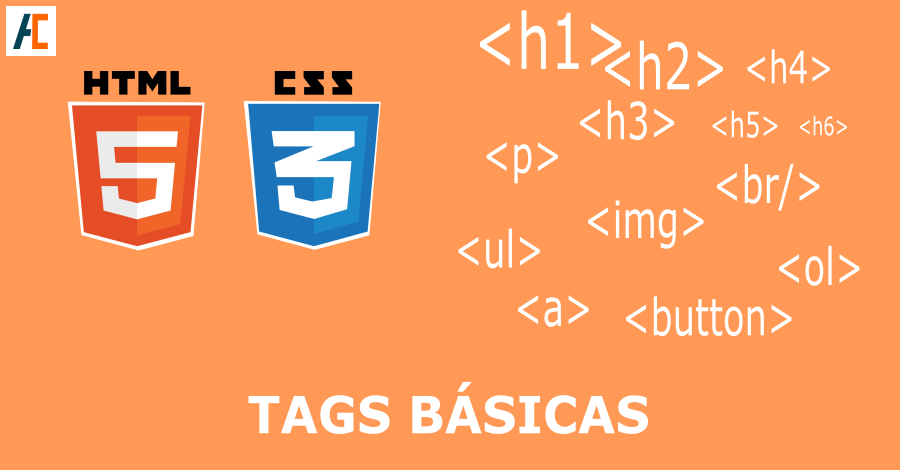
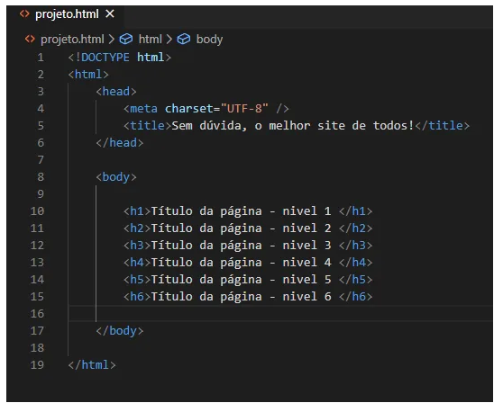
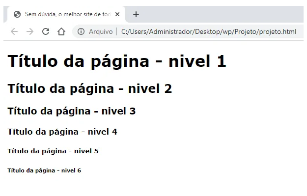
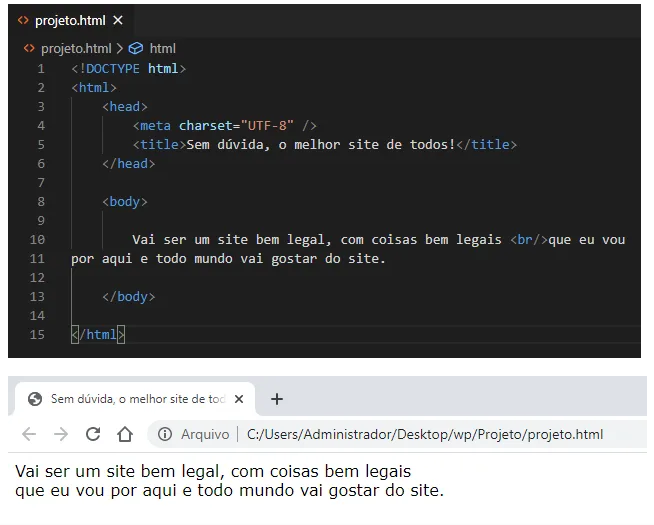
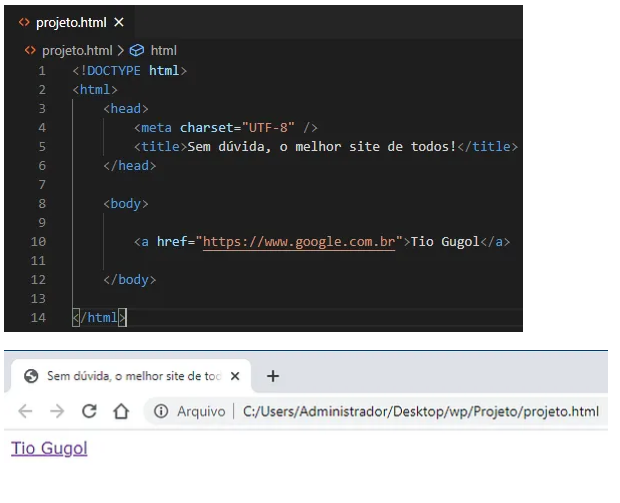
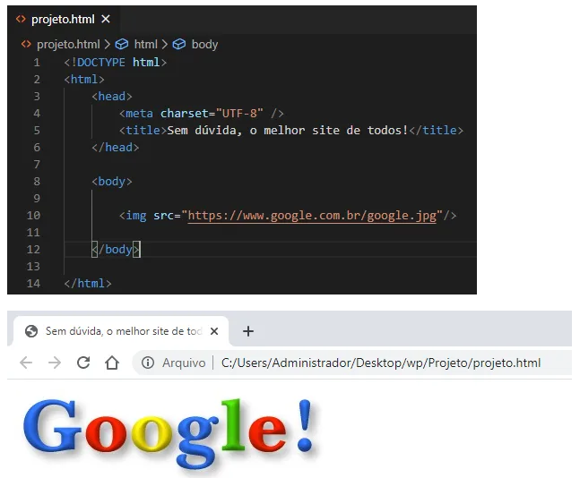
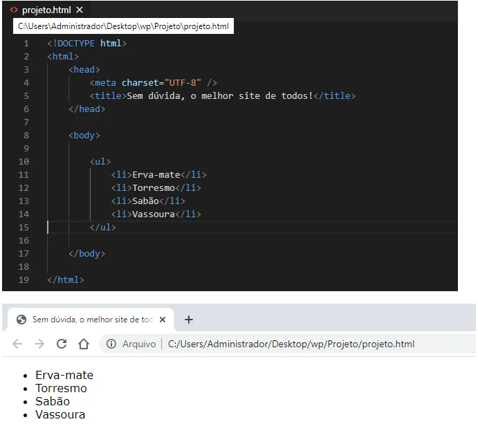
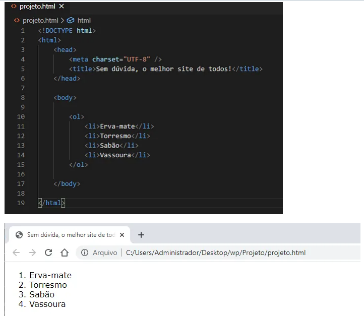
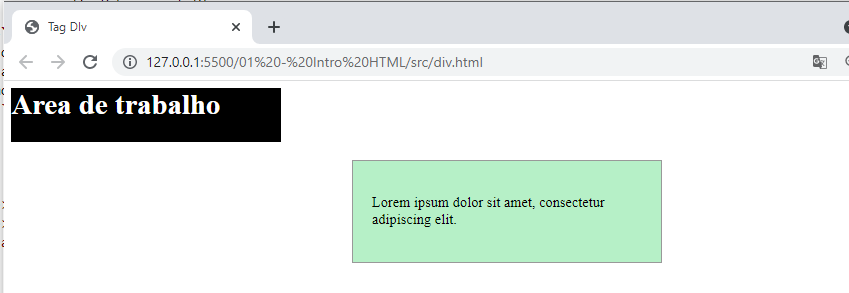

# Tags Básicas:

- As tags HTML são mecanismos de formatação e organização de conteúdos web. Elas auxiliam pessoas desenvolvedoras web a manipularem os elementos das páginas de modo preciso. Assim, torna-se mais fácil criar, atualizar e gerenciar sites e sistemas web.
<br/><br/>

## Tag Heading `<h1>` - Cabeçalho
- As tags que começam com h(h1,h2,...,h6), são utilizadas para definir títulos, sendo h1 o maior em tamanho e hierarquia e consequentemente o h6 sendo o menor.
- Outra utilidade para esta tag é a utilização do h1, em estratégias de Search Engine Optimization) – SEO 
- Exemplo:
    - 
- Resultado
    - 
<br/><br/>

## Tag Padding `<p>` - Parágrafo
- Serve para inserir um parágrafo no texto. Em outras palavras, o efeito desta tag é colocar uma quebra de linha antes da tag e no final, espaçando do restante do texto. Exemplo: 
    - 
- Temos como resultado:
    - 
    - É possível notar que por mais que eu separe o texto no código fonte, como é possível ver nas linhas 10 e 11, no navegador ele acaba juntando as duas linhas, já quando utilizo a tag no editor ele separa no navegador.
<br/><br/>

## Tag lineBReak ``<br/>`` - Quebra de linha
- Essa tag básica insere uma quebra de linha em um texto(pula linha). Vou utilizar um texto e inserir a tag no meio para ver como que fica.
    - 
<br/><br/>

## A Tag Anchor `<a>` - Link
- Esta tag básica é responsável pela inserção de link na página, sendo muito importante tanto para links internos, alternando páginas do site, quanto para links externos.
- Deve-se usar o atributo a href, que é responsável por apontar o caminho do link. Veja o exemplo a seguir: 
    - 
<br/><br/>

## Tag Image ```` - Imagem
- Essa tag é responsável por inserir imagens na página html, nesta tag deve-se usar o atributo ``src``, semelhante ao ``href`` da tag ``<a>``, responsável por apresentar a fonte do arquivo de imagem. Exemplo:
    - 
    - Para a tag image, existe um atributo muito importante, também usado no SEO , o atributo alternative, o alt='', pelas regras de SEO, deve ser introduzido na tag image, mesmo estando vazio.
<br/> <br/>
## Tag Unordered List ``<ul>`` - Lista não ordenada
- A tag ``<ul>`` serve para efetuar uma lista, neste caso sem ordenação, em conjunto com a tag list ``<li>``, certamente que vou fazer a minha lista de mercado, por exemplo:
    - 
<br/><br/>

## Tag Ordered List ``<ol>`` - Lista Ordenada
- A tag ``<ol>`` serve para efetuar uma lista, neste caso ordenada, em conjunto com a tag list ``<li>``, sendo assim, certamente vou ordenar minha lista anterior:
    - 

## Tag ``<div>`` - Division
- É um elemento HTML utilizado para dividir e agrupar os itens que serão exibidos em uma página como parágrafos, imagens, botões e muito mais.
- Para organizar as tags divs em uma página HTML, é preciso utilizar os estilos CSS. São eles que ajudam a definir as características de cada container, como o tamanho, o posicionamento e muitas outras definições para que seja possível realizar a organização desejada dos elementos inseridos na ``<div>``. 
- Exemplo:
    ```html
    <html>
        <head>
            <title>Tag DIv</title>
            <style>
                .cabecalho{
                    background-color:black;
                    color: #ffffff;
                    width: 300px;
                    height: 60px;
                }
                .centralizado {
                    background-color: rgb(182, 240, 199);
                    border: 2px solid #999;
                    width: 300px;
                    margin: 20px auto;
                    padding: 20px;
                }
            </style>
        </head>
        <body>
            <div class="cabecalho">
                <h1>Area de trabalho</h1>
            </div>
            <div class="centralizado">
                <p>Lorem ipsum dolor sit amet, consectetur adipiscing elit. </p>
            </div>
        </body>
    </html>
    ```
    - Resultado: 

# Referências
- https://aprendendoacodar.com.br/tags-basicas/
- https://blog.betrybe.com/html/div-html/